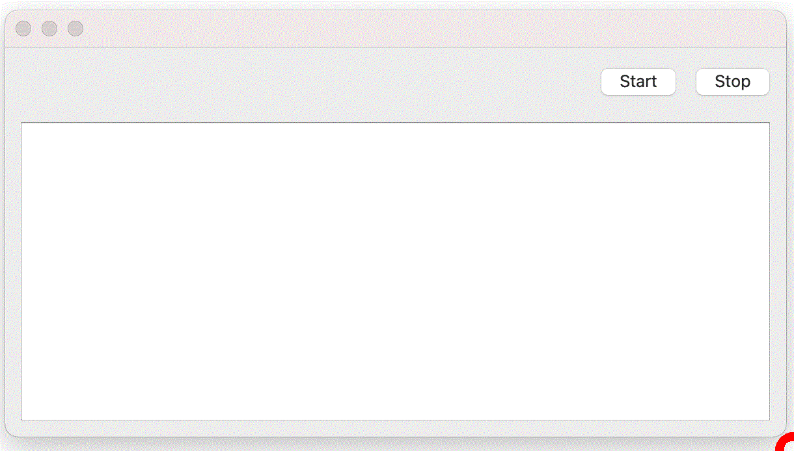

# pyqt-async-sample

Learn how to create a simple asynchronous PyQt GUI Application.

This demo program shows python print() Function on the screen, making it easy to understand how asynchronous processing works.



# You'll learn how to

- create a simple GUI applications with PyQt’s thread support
- implement asynchronous processing that can be safely started and stopped
- display the standard output process on the PyQt screen
- make it possible to display a progress bar

# Usage

### Install

The following command will install the latest version of a module and its dependencies.

```
pip install git+https://github.com/mochisue/pyqt-async-sample.git
```

### Run GUI
The following command will launch the GUI application. You can also do the same by running the [sample.py](src/sample.py) program.

```
pyqtasync_gui
```

# Sample program

I have placed the Mac OS X application [here](https://github.com/mochisue/pyqt-async-sample/releases/download/v1.0/sample.zip), sorry, but it is not notarized.
This is created with [pyinstaller](https://github.com/pyinstaller/pyinstaller).

# Note

When it comes to progress bars in python, [tqdm](https://github.com/tqdm/tqdm) is famous, but this time I dared to use [progress](https://github.com/verigak/progress). The reason is that tqdm, pyqt, and pyinstaller are not compatible.

# Author

[mochisue](https://github.com/mochisue)

# Licence

[MIT](https://github.com/mochisue/pyqt-async-sample/blob/main/LICENSE)
